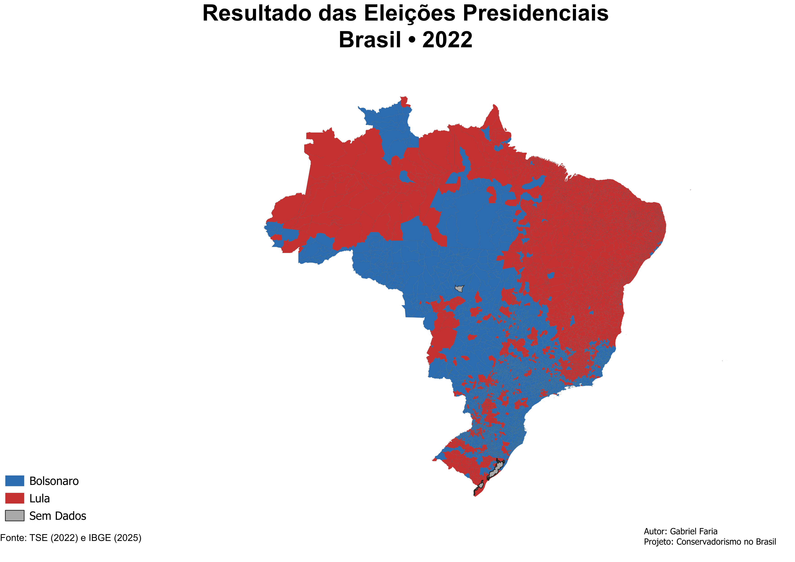

# Conservadorismo no Brasil

Projeto de análise espacial dos resultados eleitorais brasileiros utilizando QGIS, Python, dados oficiais do TSE e malhas municipais do IBGE.

## Objetivo

Analisar a distribuição espacial do voto presidencial no Brasil e identificar padrões territoriais, regionais e municipais.

## Tecnologias Utilizadas

- QGIS
- Python
- Pandas
- Geoprocessamento
- Cartografia Digital

## Fontes de Dados

- Tribunal Superior Eleitoral (TSE)
- Instituto Brasileiro de Geografia e Estatística (IBGE)

## Autor

Gabriel Faria
Licenciado em Geografia – UFPR
